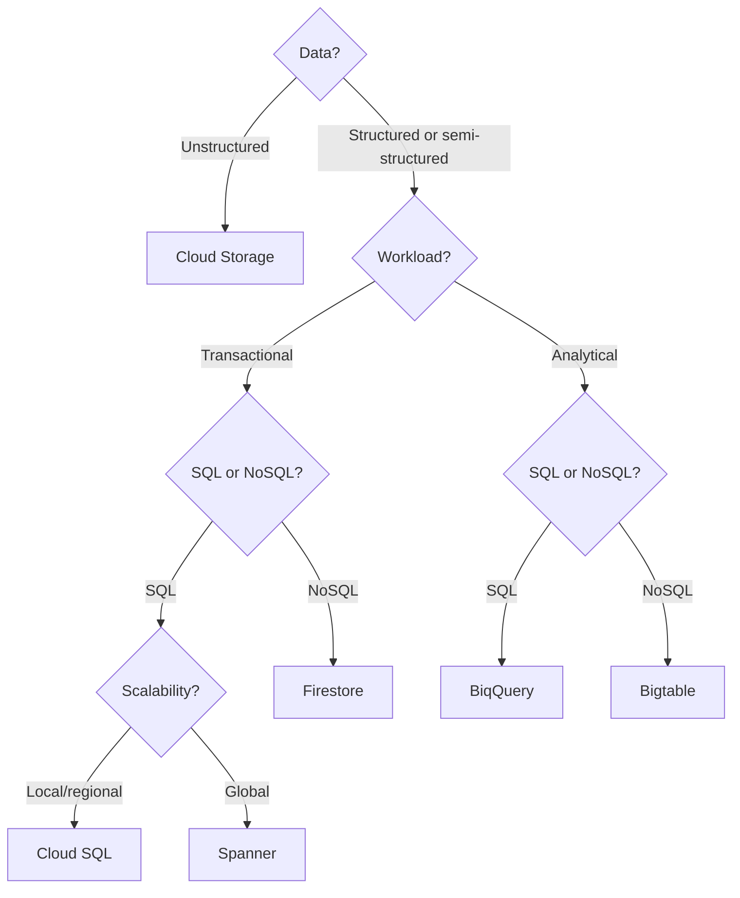

# 2 - Exploring Data Transformation with Google Cloud

- [2.1 The Value of Data](#21-the-value-of-data)
- [2.2 Google Cloud Data Management Solutions](#22-google-cloud-data-management-solutions)
- [2.3 Making Data Useful and Accessible](#23-making-data-useful-and-accessible)

---

## 2.1 The Value of Data

<ul>
  <li><strong>Value & role of data</strong></li>
  <li>
    <strong>Basic data management concepts</strong>
    <ul>
        <li><strong>Database</strong> </li>
        <li><strong>Data warehouse</strong> </li>
        <li><strong>Data lake</strong> </li>
    </ul>
  </li>
  <li><strong>Create value through data</strong></li>
  <li><strong>Cloud to gain value from data</strong></li>
  <li> 
    <strong>Data value chain</strong>
    
Text

    

      
<strong>(Picture)</strong> Data Value Chain

      
    

</li>
  <li><strong>Data governance</strong></li>
</ul>

## 2.2 Google Cloud Data Management Solutions

<ul>
    <li>Google Cloud data management solutions
        <table>
            <thead>
                <tr>
                    <th>Option</th>
                    <th>Data type</th>
                    <th>Characteristics</th>
                    <th>Use cases / examples</th>
                    <th>When to choose</th>
                </tr>
            </thead>
            <tbody>
                <tr>
                    <td>Cloud Spanner</td>
                    <td>Structured</td>
                    <td>Fully managed database service Unlimited scale (handles unexpected business spikes) Strong consistency High availability</td>
                    <td>Strong global consistency High I/O operations per second SQL relational database with joins</td>
                    <td></td>                
                </tr>
                <tr>
                    <td>Cloud SQL</td>
                    <td>Structured</td>
                    <td>Fully managed database service Migrate production database with minimal downtime via DMS</td>
                    <td></td>                    
                    <td>Don't need horizontal scaling Don't need a globally available system</td>
                </tr>
                <tr>
                    <td>BiqQuery</td>
                    <td>Structured</td>
                    <td>Fully managed data warehouse Built-in analysis tools, machine learning features SQL queries Works in a multi-cloud environment</td>
                    <td></td>
                </tr>
                <tr>
                    <td>Firestore</td>
                    <td>Semi-structured</td>
                    <td>No-SQL cloud database Flexible, horizontally scalable Stores Documents in Collections Offline data access</td>
                    <td>Nested objects, numbers, strings Automatic scaling</td>
                </tr>
                <tr>
                    <td>Cloud Bigtable</td>
                    <td>Semi-structured</td>
                    <td>No-SQL big data database service Handles massive workloads Low latency, high throughput</td>
                    <td>Google Search, Google Analytics, Google Maps, Gmail Internet of Things User analytics Financial analysis</td>
                    <td>More than 1TB of semi-structured data Fast data No-SQL data Real-time processing or machine learning on the data</td>                
                </tr>
                <tr>
                    <td>Cloud Storage</td>
                    <td>Unstructured</td>
                    <td>Fully managed, any amount and retrievals Data is managed as objects Interacts with web technologies (URLs as identifier) No predefined data model
                        
  
                            
Storage classes

                                    <ol type="1">  
                                        <li>Standard Storage: Hot data (frequently accesses & briefly saved data)</li>
                                        <li>Nearline Storage: Once per month</li>
                                        <li>Coldline Storage: Once every 90 days</li>
                                        <li>Archive Storage: Once a year (best option for data accessed less than once a year</li>
                                    </ol>
                        
Autoclass
                    </td>
                    <td>Videos Pictures Audio recordings Website content Storing data for archival Distributing large data objects</td>
                    <td>Unlimited storage Worldwide access Low latency, high durability Geo-redundancy</td>
                </tr>
            </tbody>
        </table>
        

            

                <strong>
                    (Picture)
                </strong> 
            Which Database should I use?
            

            
        

    </li>
    <li>Key data management concepts and terms</li>
    <li>Benefits of BiqQuery</li>
    <li>Modernizing a current database
        <ul>
            <li>Lift and shift</li>
            <li>Managed database migration</li>
        </ul>
    </li>
</ul>

## 2.3 Making Data Useful and Accessible

<ul>
    <li>Looker (democratizing access to data)</li>
    <li>BigQuery & Looker</li>
    <li>Real-time analytics</li>
    <li>Data pipelines within Google Cloud</li>
</ul>

